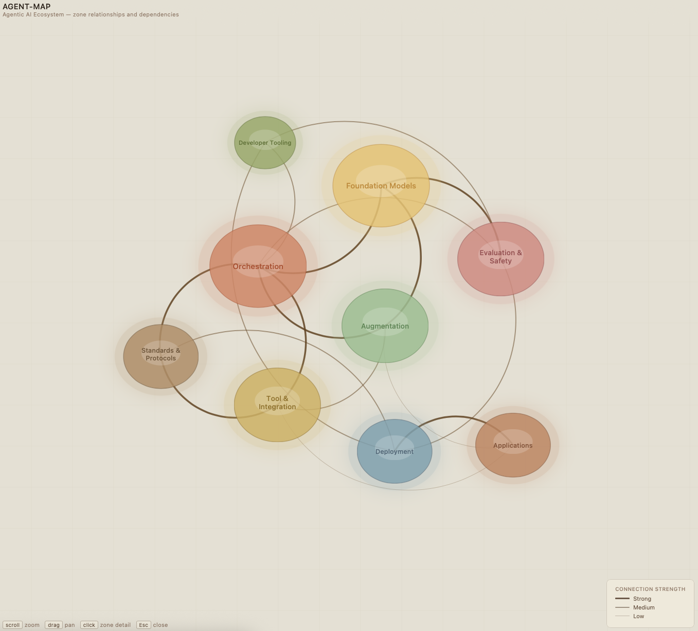
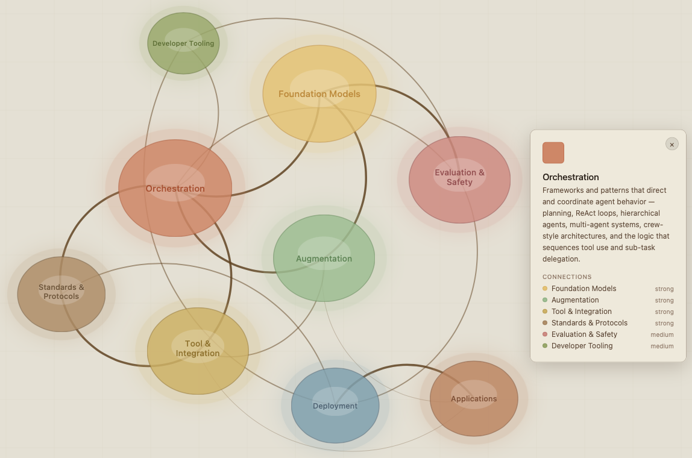

# Agent-Map

An interactive ecosystem map of agentic AI — nine functional zones, their relationships, 
and the dependencies between them. Built to complement [Agent-Layers](https://github.com/schema-syntax/Agent-Layers), 
which covers the same domain through a structured, layer-by-layer reference lens.

## What it is

A self-contained HTML file. No dependencies, no build step, no internet connection 
required. Open it in any browser and it works.

Nine zones represent the major functional areas of the agentic AI ecosystem. Their 
positions emerge organically from a D3 force-directed simulation driven by connection 
weights — zones with strong mutual dependencies pull toward each other, weaker ones 
drift to the periphery. Connection line thickness and opacity encode relationship 
strength: strong, medium, or low.

## How to use it

Hover over any zone to highlight its direct connections and dim everything else. 
Click a zone to open a detail panel with a description and a list of all connections 
— each connection in the panel is clickable, letting you navigate the ecosystem 
zone by zone. Drag zones to reposition them, scroll to zoom, and drag the canvas 
to pan.

Keyboard: `Esc` to close the detail panel.

## The nine zones

1. **Foundation Models** — the LLM core
2. **Augmentation** — memory, RAG, embeddings, context
3. **Orchestration** — frameworks, planning, multi-agent patterns
4. **Tool & Integration** — APIs, connectors, external services
5. **Standards & Protocols** — MCP, A2A, ACP and interoperability infrastructure
6. **Evaluation & Safety** — guardrails, testing, monitoring, human oversight
7. **Deployment** — cloud, local, versioning, lifecycle
8. **Developer Tooling** — observability, debugging, eval harnesses
9. **Applications** — end use cases and domain-specific products

Standards & Protocols is intentionally a standalone zone rather than folded into 
Tool & Integration — its cross-cutting nature means it connects to nearly every 
other zone, and that relationship becomes more significant as the ecosystem matures.

## Companion piece

**[Agent-Layers](../Agent-Layers)** covers the same domain as a structured reference 
tool — 68 concepts organized across eight abstraction layers with expanded definitions, 
related term navigation, and a study progress tracker. The two artifacts are designed 
to be used together.

## Credits

Original concept and design developed with the assistance of 
[Claude](https://claude.ai) (Anthropic).
